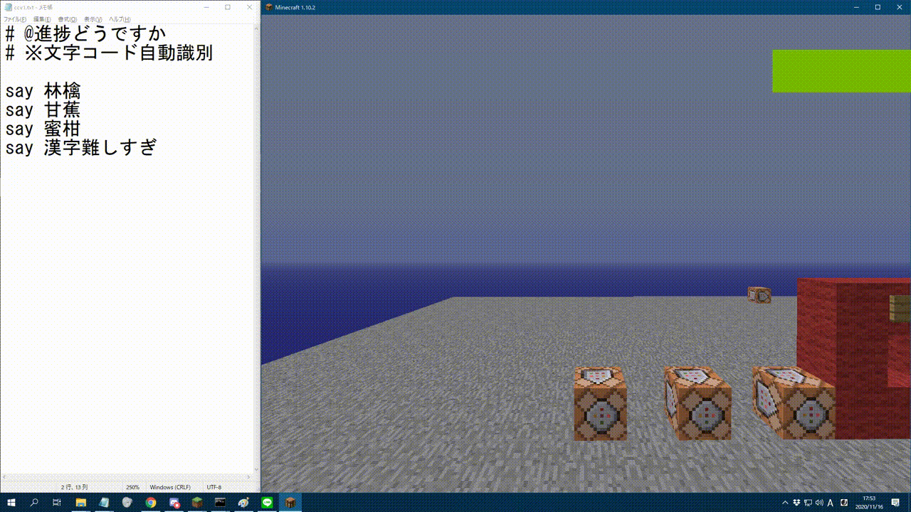
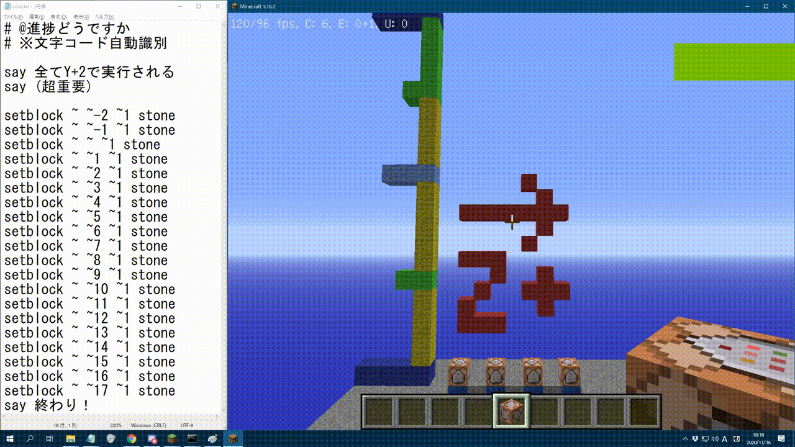
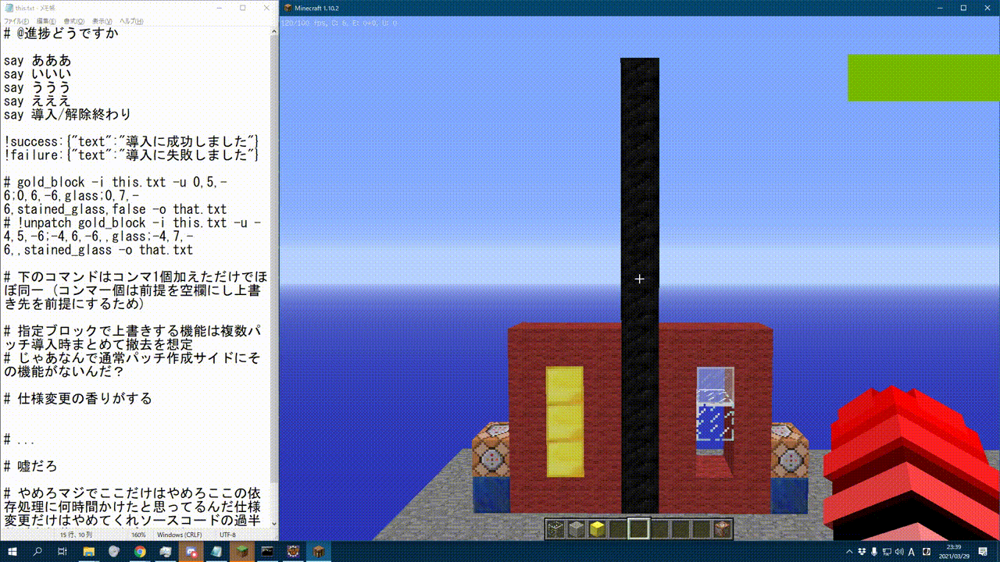

# ezpatch
EXにEZになる環境問わず(Java必須)のパッチ制作ソフト。

### 本リポジトリについて
本リポジトリは自動アップデート用に制作されたリポジトリです。  
ソースは都合上公開されません。  
アップデートし次第アップデートログなどを順次記載していく予定です。  

本体のダウンロードは [こちら](ezpatch.jar?raw=true)  
※アップデートソフトは本体の実行時に自動でダウンロードされますが、  
　自動アップデートソフトを使って本体をダウンロードしたい奇抜な方は[こちら](updater.jar?raw=true)

## v1.2で追加された自動アップデートソフトについて

珍しくコンソールなしのダブルクリックでの実行が可能です。  
但し、その形式での実行が可能なのは自動アプデソフトに限ります。今は。

## そもそも ezpatch ってなんや？
ezpatchとは、TUSBのパッチ制作を簡単にするために制作されたコマンド圧縮ソフトセットです。  
このソフト一つでTUSB v12に導入するためのパッチの製作が可能です。  
MCVer1.10.2に基づいて制作されているため、その他のバージョンでは動作が保証されません。  

## 使い方

**本ソフトは実行時にjavaが必要になります。  
インストールがまだ済んでいない場合は先にインストールを済ませてください。**  
  
[jarファイル自体の基本的な使い方]  
1、ezpatch.jar のある場所でコマンドプロンプトを開きます。  
2、`java -jar ezpatch.jar [サブコマンド]` のように入力して実行します。  
※ 表記の簡易化の為この `java -jar ezpatch.jar` の構文を以下では (ezpatch) と置きます。  
  
ezpatch本体を引数無しで実行することでも使用方法の確認は可能ですが、  
CUIのみでの説明はとても難解なため、本リポジトリではより詳細に記載します。  
文字数が増えてるようにも見えますが、**太字だけ読めば大体理解できます**。

##### どの利用法にも共通すること

どのように利用する場合でも入力ファイルの指定が必須です。  
入力ファイルは `-i ファイル名` のように指定します。  
入力ファイルの中では **# によるコメントアウト** が可能です。  
また、入力ファイルのどこかに **`@進捗どうですか` と記載することで  
自動でファイルエンコードを検出**することが可能です。  
表記が無かった場合、システムのデフォルトエンコードを使用します。  
ファイルエンコードが異なったりアクセス権限が不足していたりすると圧縮に失敗します。  
  
出力ファイルは表記しないことも可能ですが、  
**出力先を明示する場合は `-o ファイル名` のように指定**します。  
指定された出力先に既にファイルがある場合実行に失敗します。  
出力先ファイルのエンコードは入力ファイルと同じになります。  
**出力先を指定しなかった場合コンソールに出力**されます。

#### CommandCompresserV1として利用する場合

Q: CCv1ってそもそもなんや?  
A: ezpatchが完成する前に使用された今よりも機能が少ない圧縮ソフトです。  
　この圧縮ソフトでは入力されたコマンド群を単純に積み上げるように圧縮します。  
　折り返しや自動消去もなく、インパルス&自動実行でただ積み上げるだけです。  
　圧縮後に手動で改変を行うことで特殊な処理を行うことが可能です。(方法は面倒なので割愛)  
　多分特殊なことを行わない限り**基本使わない**はず。
  
CCv1の実行結果例：  

  
CCv1として圧縮するには以下のように実行します。  
`(ezpatch) CCv1 <-i 入力ファイル名> [-o 出力ファイル名]`  

#### CommandCompresserV2として利用する場合

Q: CCv2ってそもそもなんや?  
A: ezpatchが完成する前に使用されたCCv1よりまともな圧縮ソフトです。  
　この圧縮ソフトでは入力されたコマンド群を同じ座標で実行して実行後に自動消去します。  
　また、FallingSandの落下時間上限を回避するための区切り個数の指定が可能です。  
　本ソフトでは前提パッチなどの指定は行えません。  
　多分特殊なことを行わない限り**基本使わない**はず。  

CCv2として圧縮するには以下のように実行します。
`(ezpatch) CCv2 <-i 入力ファイル> [-o 出力ファイル] [-c 区切り個数]`

##### 圧縮率(区切り個数)について

本ソフトをCCv2またはezpatchとして実行する場合、区切り個数の指定が可能です。  
区切り個数を指定しないことも可能ですが、指定することでスペースの消費を抑えたり、  
FallingSandの落下時間上限への到達を回避したりすることが可能です。  
  
比較用動画：右から順に 無圧縮 圧縮率5 圧縮率8 圧縮率12  

#### ezpatch として実行する場合

Q: ezpatchってそもそもなんや?　**(読まなくておk)**  
A: ezpatchとはTUSB専用に制作されたパッチ制作ソフトで、  
　このソフトを用いることで「競合を回避したパッチの製作」が可能になります。  
　TUSBではコマンドは機能ごとに列を分けて設置されているため、  
　同じ列に複数のパッチが導入されるとパッチが競合し、  
　製作者の意図しない動作が発生する恐れがあります。  
　本ソフトでは各パッチにIDを指定し使用するコマンド列を指定することで  
　パッチの競合を回避することが可能になります。  
  
ezpatchとして圧縮するには以下のように実行します。  
**`(ezpatch) <パッチID(下記)> <-i 入力ファイル> [-o 出力ファイル] [-c 区切り個数] [-u 依存列(下記)]`**  
  
...薄々気付いてるかもしれませんがかなり面倒な仕様になっています。  
おい製作者、なぜこんな直感的に使えないソフトにした(  

##### パッチIDとは

パッチIDとは各々のTUSBパッチを区別するために用いられる重複不可のMCBlockIDですが、  
実際に設置されることを考慮し**「外部に影響を与えない」「外部干渉(赤石信号など)により変化しない」ブロックID**としています。  
本ソフト内ではメタデータ・データタグ(NBT)を指定するためにそれを以下の表記で使用します。  
  
**`ブロックID[@メタデータ[@データタグ(外括弧必須)]]`**
例) stone_block
    acacia_stairs@1
    chain_command_block@8@{Command:test}

##### 依存列のフォーマット

**依存列は複数ある場合 `;` で区切ります**。  
  
個々の依存指定は以下のように行います。  
**`x,y,z[,前提パッチ[,上書き確認]]`**  
例) -1922,9,-192
    -1922,17,-191,gold_ore
    -1922,8,-188,

x,y,zには**変更を加えるコマンド列の先頭 (大抵の場合xは-1922)** が入ります。  
  
前提パッチが必要になる場合、座標の後にコンマを付けパッチID(上記)を指定します。  
指定しなかった場合何もパッチがないことを前提とします。  
**省略は可能ですが空白は不可能です**。  
前提パッチが存在する場合、そのブロックを上書きするかどうかを指定できます。  
記入しなかった場合自動で上書きされますが、コンマを付けtrue/falseを書くことで上書き宣言可能です。  

##### 解除用パッチ作成機能

本ソフトはパッチIDの前に!unpatch引数を加えることで、  
依存関係の指定をプログラム内で逆転させ**ほぼ同じ設定で解除用パッチを作成することが可能**です。  
  
**`x,y,z[,[前提パッチ][,上書きパッチ]]`**  
  
指定しなかった場合、前提パッチと上書きパッチにはそれぞれ 自身のパッチID と 空気 が入ります。  
要は、依存関係にコンマ1つ加えればそのまま解除用パッチに流用できます。  
...正直、ここに長い間バグが残っていたのですが誰も使っていなかったため誰も気づくことがありませんでした。  
   大規模な改編でさらなる改善が見込めますが、誰も使わないっぽいので放置も考慮してます。  
  
比較用動画:  ← !unpatch を使用した例 通常通り圧縮した例 →  

## ライセンス

本ソフトには以下のライブラリを用いています：  
[JLine3](https://github.com/jline/jline3)  
[JLine-Terminal-JNA](https://mvnrepository.com/artifact/org.jline/jline-terminal-jna)  
[Java Native Access](https://github.com/java-native-access/jna)  
本ソフトはApacheLicense2.0に基づくソフトを使用しています。  
本ソフトはCreativeCommons4.0(CC BY 4.0)によりライセンス付与された創作物を使用しています。

## 隠し要素

かなり壮大な何かがそこに隠されているかもしれない...?
